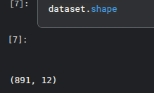
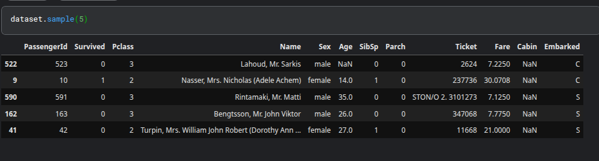
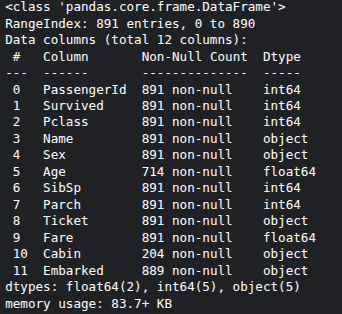
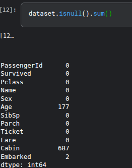
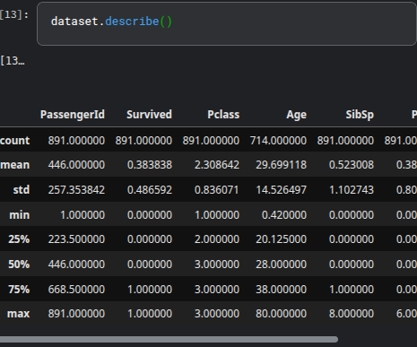
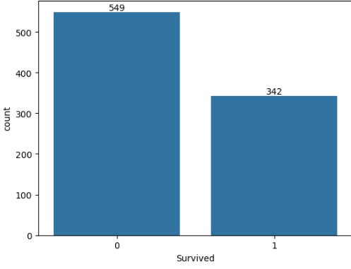
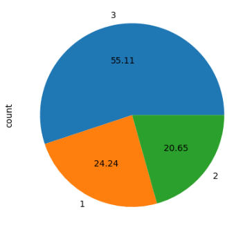

# Exploratory-Data-Analysis
## Understanding data
Understanding the dataset is the first and most important step in any machine learning project.In order to understand the dataset, I explored the Titanic dataset and performed data analysis using key questions such as data size, structure, data types, missing values, and feature relationships.

1.How big is your data?

Firstly, we need to find how big our dataset is.For this, we use
 dataset.shape

This dataset contains 891 rows and 12 columns
  
2.How does data look like ?

Secondly, it is necessary to look the structure of the datset.For this,we use:
dataset.head() or dataset.sample()

3.What is the data type of columns ?

 Now , we find the data type of columns using info().
 
 

4.Are there any missing values ?

we use isnull() to find out missing values in a  features.

As we see Cabin feature has highest missing values which is about 60 % so we removed  this features from the dataset

5.Are there any duplicate values?

Duplicate values should be drop from the dataset for perfect model.First ,we determined the no of duplicates values in the dataset  using duplicated().sum() and then we droped those columns using drop_duplicate function

6.How does the data look mathematically?

The .describe() method provides a summary of numerical columns in the dataset, helping you understand the distribution and key statistics of the data. 

7.How is the Correlation between the columns?

The .corr() method in pandas is used to calculate the correlation between numerical columns in a dataset. It helps identify how strongly two variables are related to each other.
## EDA using Univariate Analysis
Data is categorized into numerical and categorical.Numerical data consists of values that are measurable and expressed as numbers while categorical data represents labels or categories.

### Categorical data 
We perform EDA of categorical data using countplot or using value_counts function from pandas library  and piechart.As we are performing univariate analysis ,we look each categorical data individually.
Performing univariate analysis in titanic dataset.

sns.countplot(dataset['Survived'])

The bar chart shows that out of 891 passengers ,only 342 passengers was survived.

dataset['Pclass'].value_counts().plot(kind = 'pie',autopct = '%.2f')

The piechart illustrates that the most passengers was travelled in a pclass 3 while least passengers was travelled in a pclass 2.